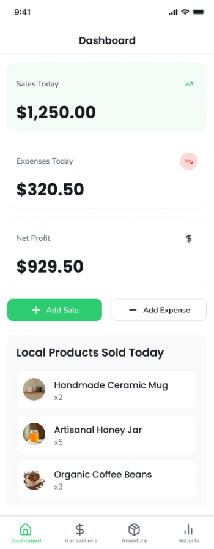
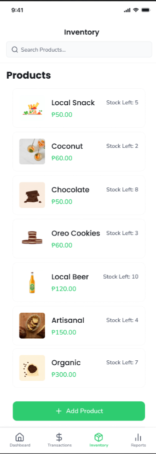
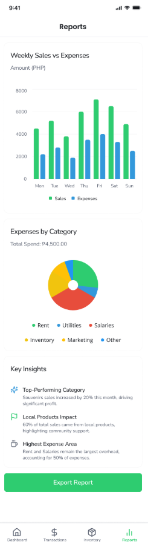

# SmartBizHelper

**SmartBizHelper** is a comprehensive mobile solution designed to empower small business owners by simplifying financial tracking, inventory management, and sales reporting. Developed as part of a **Mobile Application Design and Development** course, it bridges the gap between complex accounting software and manual ledger booking.

---

## ## Core Features

### 📊 Real-Time Dashboard

Get an immediate overview of business health. The dashboard displays **Daily Sales**, **Expenses**, and **Net Profit** at a glance.
* **Quick Actions:** Instant buttons to "Add Sale" or "Add Expense."
* **Local Product Tracking:** Monitors "Local Products Sold Today" to measure community-supported inventory impact.
 

---

### 📦 Inventory & Product Management

Keep your shelves organized with a digital catalog.
* **Visual Status:** Monitor stock levels with clear indicators (e.g., "Stock Left: 5").
* **Local Tagging:** Mark items as "Local Products" to promote regional culture and heritage.
* **Easy Entry:** Streamlined forms to add product names, unit prices, and quantities.
 

---

### ➕ Add New Products
  

The system simplifies product onboarding with a dedicated "Add Product" interface. 
* **Product Details:** Assign names, unit prices, and stock counts.
* **Local Promotion:** A dedicated toggle to designate products that support local culture.
* **User-Friendly:** Includes descriptive hints under each field to ensure accurate data entry.
 

---

### 💸 Transaction Logging
  

Effortlessly record every cent moving in or out of the business.
* **Categorization:** Organize logs into Snacks, Drinks, Souvenirs, Services, and more.
* **Visual Toggles:** Switch between **Sale** (Green) and **Expense** (Red) modes for instant visual feedback.
* **Impact Check:** Specifically flag transactions involving local goods.
 

---

### 📈 Advanced Reporting & Insights

Transform raw data into actionable visual insights for better growth.
* **Weekly Comparison:** High-contrast bar charts comparing Sales vs. Expenses.
* **Expense Breakdown:** A pie chart detailing overhead like Rent, Salaries, and Inventory.
* **Key Insights:** Automated summaries of top-performing categories and community impact metrics.
 

---

## UI/UX Design & Branding

| Splash Screen | Secure Login | Account Creation |
|---|---|---|
|  |  |  |

The application features a **clean, modern aesthetic** with a professional green-to-blue gradient identity. High-contrast action buttons and intuitive icons ensure a seamless experience for busy entrepreneurs.

---

## Technical Workflow
* **Authentication:** Secure onboarding via customized Sign Up and Login screens.
* **Data Management:** Full CRUD (Create, Read, Update, Delete) capabilities for inventory and transactions.
* **Visualization:** Dynamic chart rendering based on real-time user data using mobile-optimized libraries.
* **Exporting:** Built-in "Export Report" functionality to facilitate external bookkeeping.
